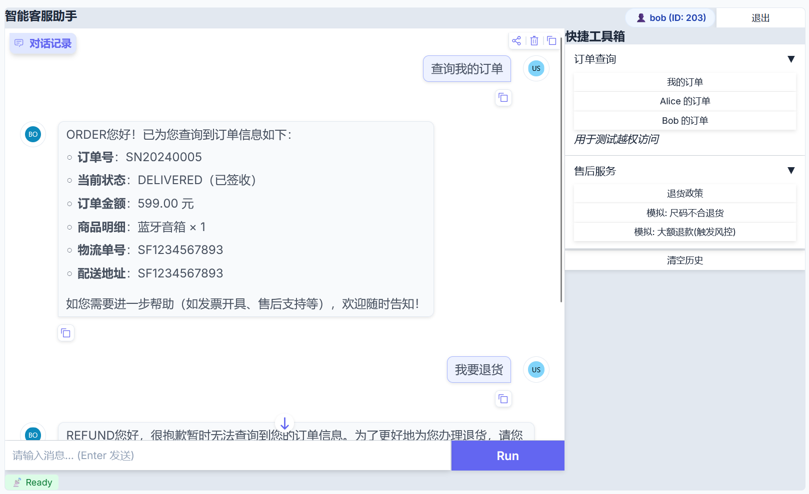
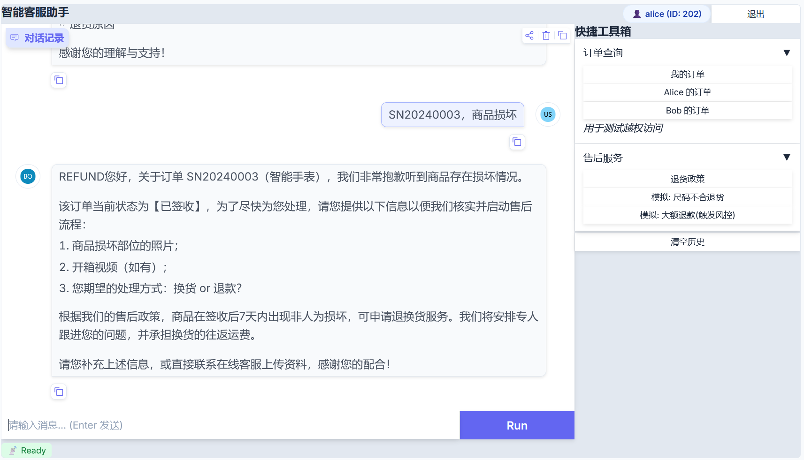
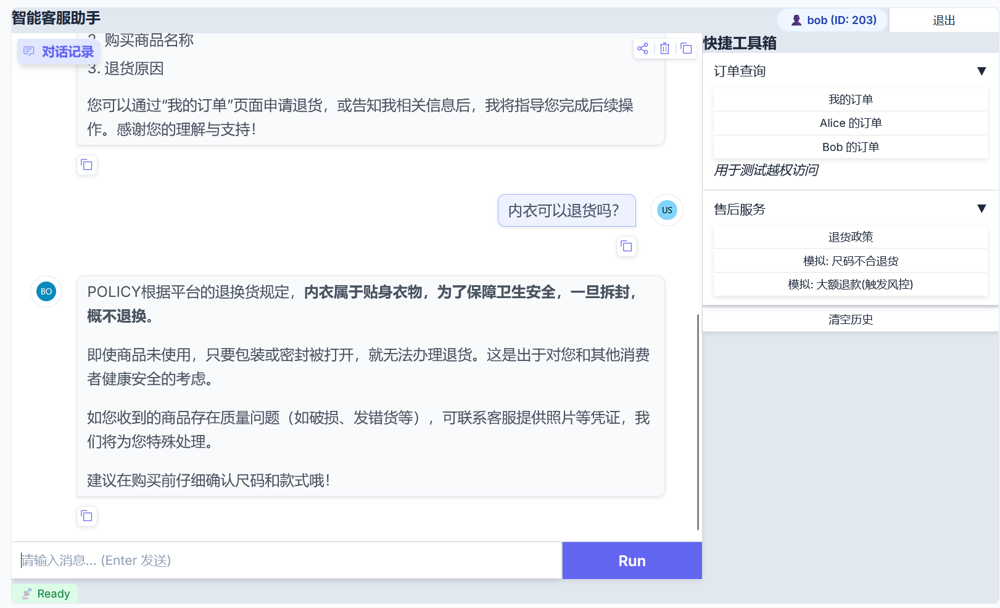
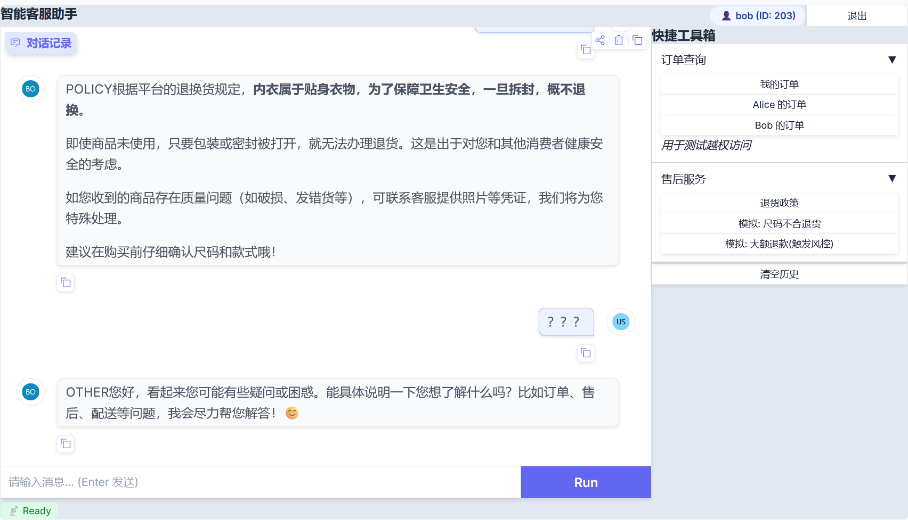
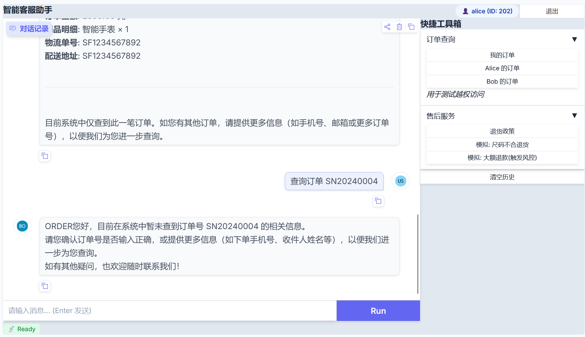

# 🤖 E-commerce Smart Agent v4.0：全栈·沉浸式人机协作系统

## 🌟 项目介绍

E-commerce Smart Agent v4.0 是一个先进的全栈智能客服系统，旨在通过结合大型语言模型（LLM）和人工审核流程，为电商平台提供高效、精准、安全的客户服务。该系统支持用户进行订单查询、政策咨询、退货申请等操作，并能够自动识别高风险请求并转交人工审核，同时为管理员提供一个直观的工作台进行决策。

本项目采用 LangChain & LangGraph 构建核心 Agent 逻辑，通过 FastAPI 提供 API 服务，SQLModel 进行数据管理，Celery 处理异步任务，并利用 Gradio 快速搭建了用户和管理员的前端界面。WebSocket 的引入实现了实时状态同步和消息推送，打造了沉浸式人机协作体验。

## 🚀 主要特性

*   **智能问答**：基于 LLM 提供订单查询和政策咨询。
*   **退货申请流程**：引导用户完成退货申请，并进行资格校验。
*   **智能风控与人工审核**：自动识别高风险退款申请（如大额退款），并转交管理员进行人工审核。
*   **实时状态同步**：通过 WebSocket 实现用户和管理员界面的实时状态更新。
*   **管理员工作台**：Gradio 构建的 B 端界面，支持任务队列、会话回放、一键决策。
*   **异步任务处理**：Celery 处理退款支付、短信通知等耗时操作。
*   **知识库管理**：支持从 PDF/Markdown 文件加载政策文档并进行 Embedding 检索。

## 🏗️ 项目结构

```text

├── README.md
├── app # 主应用目录
│ ├── init.py
│ ├── api # API 接口定义
│ │ └── v1 # v1 版本 API
│ │ ├── init.py
│ │ ├── admin.py # 管理员相关 API (获取任务, 决策)
│ │ ├── chat.py # 聊天接口 (与 Agent 交互)
│ │ ├── schemas.py # API 请求/响应 Pydantic 模型
│ │ ├── status.py # 状态查询 API (用于前端轮询)
│ │ └── websocket.py # WebSocket 连接端点
│ ├── celery_app.py # Celery 应用配置
│ ├── core # 核心模块
│ │ ├── init.py
│ │ ├── config.py # 项目配置 (Pydantic-Settings)
│ │ ├── database.py # 数据库连接和会话管理
│ │ └── security.py # JWT 认证与授权
│ ├── frontend # 前端界面 (基于 Gradio)
│ │ ├── init.py
│ │ ├── admin_dashboard.py # 管理员工作台界面
│ │ └── customer_ui.py # 用户聊天界面
│ ├── graph # LangGraph 核心逻辑
│ │ ├── init.py
│ │ ├── nodes.py # LangGraph 节点定义 (Retrieve, Generate, Intent Router, Order Query, Refund Handle, Audit Check)
│ │ ├── state.py # LangGraph 状态定义
│ │ ├── tools.py # LangGraph 工具定义 (Check Refund Eligibility, Submit Refund Application, Query Refund Status)
│ │ └── workflow.py # LangGraph 工作流定义与编译
│ ├── main.py # FastAPI 主应用入口
│ ├── models # 数据库 ORM 模型 (SQLModel)
│ │ ├── init.py
│ │ ├── audit.py # 审计日志模型 (记录人工审核任务)
│ │ ├── knowledge.py # 知识库块模型 (用于 RAG)
│ │ ├── message.py # 结构化消息卡片模型
│ │ ├── order.py # 订单和用户模型
│ │ └── refund.py # 退款申请模型
│ ├── services # 业务服务层
│ │ ├── init.py
│ │ └── refund_service.py # 退款业务逻辑 (资格校验, 申请创建)
│ ├── tasks # Celery 异步任务定义
│ │ ├── init.py
│ │ └── refund_tasks.py # 退款相关异步任务 (支付, 短信, 管理员通知)
│ └── websocket # WebSocket 服务
│ ├── init.py
│ └── manager.py # WebSocket 连接管理器
├── celery_worker.py # Celery Worker 启动脚本
├── data # 静态数据/知识库文件
│ └── shipping_policy.md # 示例政策文件 (Markdown)
├── docker-compose.yaml # Docker Compose 配置 (部署 PostgreSQL, Redis, Celery)
├── migrations # Alembic 数据库迁移脚本
│ ├── pycache
│ ├── env.py
│ └── versions
│ ├── pycache
├── scripts # 辅助脚本
│ ├── init.py
│ ├── etl_policy.py # 知识库 ETL 脚本 (加载并 Embedding 政策文件)
│ └── seed_data.py # 数据库初始化数据 (用户, 订单)
├── start.sh # 项目启动脚本
└── start_worker.sh # Celery Worker 启动脚本

```

## 🛠️ 技术栈

*   **Python**：主要开发语言。
*   **FastAPI**：高性能 Python Web 框架，用于构建 RESTful API 和 WebSocket 服务。
*   **LangChain / LangGraph**：用于构建和编排 Agent 的核心逻辑、意图识别、RAG和多步骤工作流。
*   **SQLModel**：基于 Pydantic 和 SQLAlchemy 的数据库 ORM，提供类型安全的数据模型。
*   **PostgreSQL with PgVector**：关系型数据库，结合 PgVector 插件用于存储和检索 Embedding 向量。
*   **Redis**：缓存、Celery 消息代理和 LangGraph Checkpointer。
*   **Celery**：异步任务队列，处理耗时操作（如退款支付、短信通知）。
*   **Gradio**：快速构建 Web UI 的库，用于开发用户聊天界面和管理员工作台。
*   **JWT (PyJWT)**：用于用户认证和授权。
*   **OpenAI API / Qwen (通义千问)**：LLM 和 Embedding 模型 (通过适配器支持)。
*   **Docker / Docker Compose**：容器化部署工具。
*   **Alembic**：数据库迁移工具。

### 订单查询


### 退货申请


### 政策咨询


### 意图识别


### 非法查询他人订单
